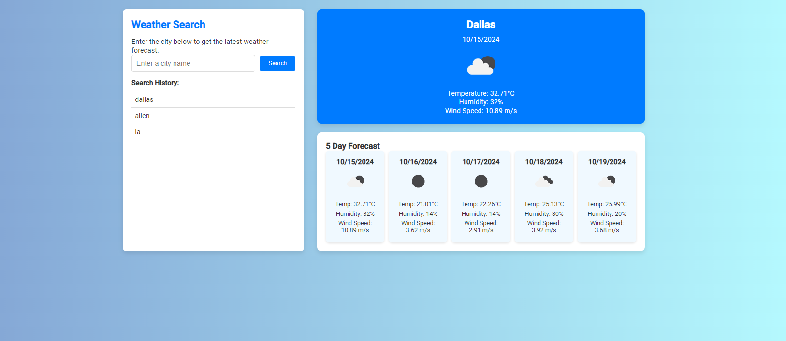

# Weather Dashboard

## Description

The Weather Dashboard is a web application that provides users with real-time weather information and a 5-day forecast for any city they search. 

- **Motivation**: The goal of this project is to provide an easy-to-use tool for travelers, commuters, or anyone who wants to stay updated on weather conditions.
- **Why build this project?**: Having up-to-date weather information can help users make informed decisions about their plans and travels.
- **Problem solved**: It offers a convenient way to get weather updates in one place, including temperature, humidity, and wind speed, as well as a 5-day forecast.
- **What I learned**: This project helped deepen my understanding of working with APIs, handling asynchronous JavaScript using `fetch()`, and dynamically updating the DOM.

## Table of Contents (Optional)

- [Installation](#installation)
- [Usage](#usage)
- [Credits](#credits)
- [License](#license)

## Installation

To install and run this project locally, follow these steps:

1. Clone the repository:  
    ```
    git clone https://github.com/Justbeingtai/Weather-Dashboard.git
    ```
2. Navigate to the project directory:  
    ```
    cd weather-dashboard
    ```
3. Open `index.html` in your browser.

## Usage

1. Enter the name of any city in the input field and click the **Search** button.
2. The dashboard will display the current weather for the city, including:
   - City name
   - Date
   - Weather icon
   - Temperature in Celsius
   - Wind speed in meters per second
   - Humidity percentage
3. The 5-day weather forecast is also displayed, showing:
   - The date
   - A weather icon representing the conditions
   - Temperature, wind speed, and humidity
4. Previously searched cities are stored in the search history, allowing users to click on a city to quickly retrieve its weather information.



## Credits

This project was completed individually, but here are some key resources that were helpful:
- **OpenWeather API**: For retrieving real-time weather data.  
  (https://openweathermap.org/)
- **Day.js**: For handling and formatting dates.
- **Bootstrap**: For CSS styling and layout.  
  (https://getbootstrap.com/)

## License

This project is licensed under the MIT License. For more details, refer to the LICENSE file in the repository or visit [https://choosealicense.com/](https://choosealicense.com/).

---

## Features

- **Real-time weather updates**: Provides the current weather details and future conditions.
- **5-Day Forecast**: Displays a 5-day weather forecast for any searched city.
- **Search History**: Allows users to quickly access previously searched cities.
- **Interactive UI**: A clean, modern interface that updates dynamically as users input city names.

## How to Contribute

If you'd like to contribute to this project, feel free to fork the repository and submit a pull request. All contributions are welcome!

## Tests

Currently, no automated tests are implemented for this project. Testing has been done manually by checking the accuracy of the weather data and the functionality of the search history.
